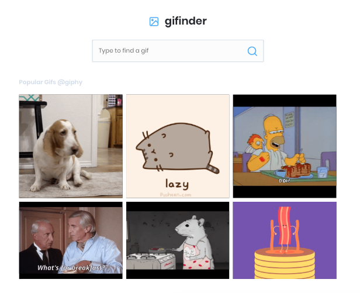

# Gifinder

Gifinder is a simple react application prototype for finding GIFS. Because this is a prototype, it uses the [GIPHY](https://developers.giphy.com/docs/) public API.

## Getting Started

To run this application please follow these instructions.

### Installing

Run the following commands to start the app in development mode. Please check the package.json script for further modes.

First clone this repo and enter to the app directory:
```sh
$ git clone https://github.com/richardblondet/react-giphy-client.git && cd react-giphy-client

```
Then install all dependencies and start the app:
```sh
npm install && npm run dev
```


## Built With

* [React](https://reactjs.org/) - The web framework used
* [NextJS](https://nextjs.org/) - The react config framework
* [React Icons by Netlify](https://react-icons.netlify.com/) - [Feather Icons](https://feathericons.com/) for beautiful open source icons 
*  [NPM](https://www.npmjs.com) - Dependency management
* NodeJS

## Contributing

Please read [CONTRIBUTING.md](CONTRIBUTING.md) for details on our code of conduct, and the process for submitting pull requests to us.


## Authors

* **Richard Blondet**  - [RichardBlondet](https://github.com/richardblondet)

## License

This project is licensed under the MIT License - see the [LICENSE](LICENSE) file for details.